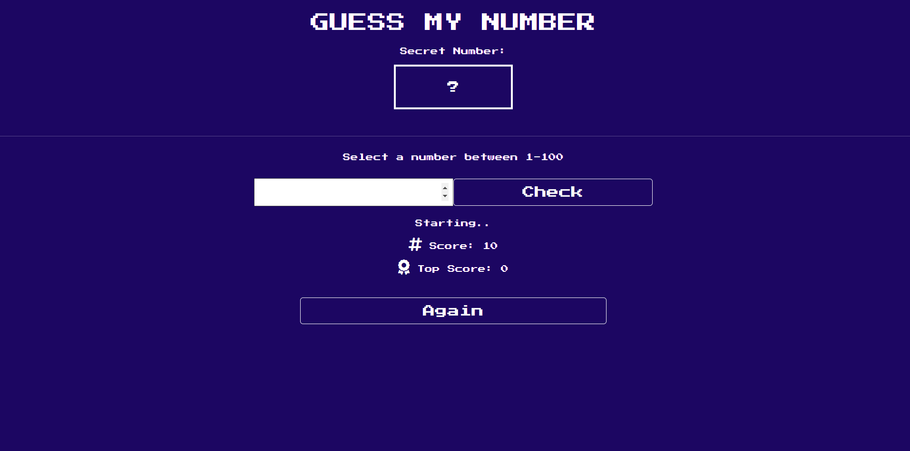

<p align="center">
<a href="https://www.linkedin.com/in/ozkankomu/" target="_blank"></a>
</p>


Find Number Game

## Table of contents

  - [The challenge](#the-challenge)
  - [Screenshot](#screenshot)
  - [Project Skeleton ](#project-skeleton)
  - [Links](#links)
  - [Built with](#built-with)
  - [Useful resources](#useful-resources)
- [Author](#author)


## The challenge
Number guessing game from our childhood. I specifically chose the font family and the backgrounds to be reminiscent of old times. You have the right to try the game 10 times and the computer will guide you up or down in each attempt. Have fun.
## Project Skeleton 

```Find Number Game

|----README.md                   
|----game.js
|----index.html  
|----style.css   

```

## Screenshot
<p align="left">
<a href="https://ozkankomu.github.io/Gues_Number_Game_JavaScript/"></a>
</p>


## Links
<hr>
<b>Check The Live Website ➡️</b> <a href="https://ozkankomu.github.io/Gues_Number_Game_JavaScript/">Live Website</a>
<hr>

### Built with
- js DOM Manipulation
- Semantic HTML5 markup
- CSS custom properties
- Flexbox
- CSS Grid
- Mobile-first workflow
- JS DOM Manipulation	


## Notes

- I used HTML, CSS , JavaScriptto complete this project.

### Useful resources

- [W3 Schoold](https://www.w3schools.com/) - This helped me for basics of website paradigm. I really liked this pattern and will use it going forward.
- [MDN](https://developer.mozilla.org/en-US/) - This is an amazing document which helped me finally understand deep sides of web development. I'd recommend it to anyone still learning these concepts.


## Author

- Author - [Ozkan]

<center> &#8987; Happy Coding  &#9997; </center>
